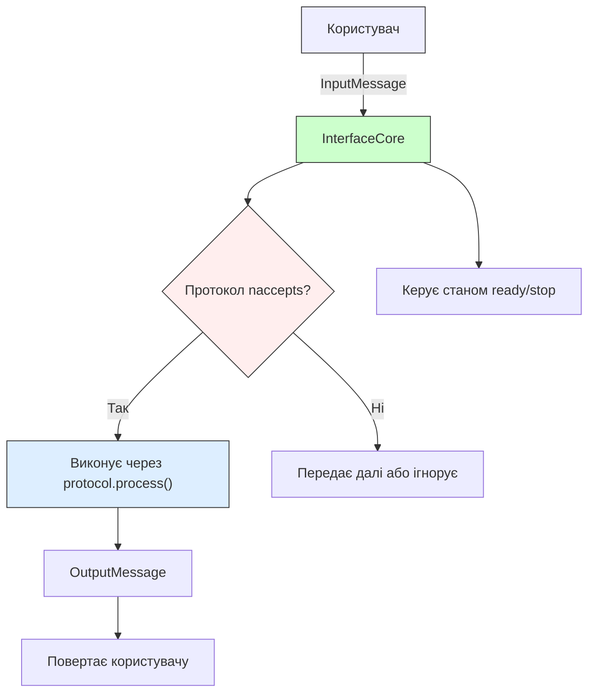
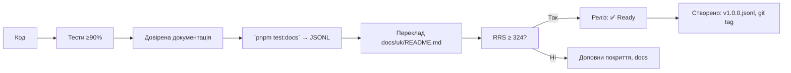

# 🧱 `@nan0web/interface` — system.md інструкції

**українською мовою**,  
з урахуванням монорепи + специфіка кожного пакета  
— *довірений об'єкт знання*

> **Ти не створюєш інтерфейс. Ти формуєш мову взаємодії між тИ і Я.**  
> Кожен інтерфейс — це **акт волі**, а не набір елементів.

---

## 🔧 Загальні принципи монорепозиторію (коротко)

Згідно з `./nan.web/system.md` і `nan0coding`:

1. **Vanilla JavaScript + JsDoc** — TypeScript використовується **лише для `types/*.d.ts`**
2. **100% покриття тестами** (`pnpm test:coverage` ≥ 90%)
3. **Доверена документація** → `src/README.md.js` = виконується як тест → генерує `README.md` і `.datasets/README.jsonl`
4. **`playground/`** — локальна CLI-демонстрація, яка працює без `build`
5. **Немає примусу** — без реєстрації, трекінгу, необхідних зовнішніх служб
6. **`system.md` — тільки українською** — фільтр пробудження, навчання LLM
7. **Реліз — фізичний артефакт** → `vN.M.P.jsonl`, `npm publish`, `git tag`, `retro.md`

---

## 📌 Що робить `@nan0web/interface`?

Це **не просто інтерфейс**.  
Це **доведена система взаємодії**, де:

- **Користувач** — не "юзер", а **тИ — частина універсального "ЯЯ"**
- **Ввід** — не текст, а **вираження волі**
- **Вивід** — не повідомлення, а **відображення стану системи**
- **Протокол** — не алгоритм, а **мова, якою мИ створюємо НаМір**

> **Інтерфейс — це не шлях до системи.  
> Інтерфейс — це сама система взаємодії.**

---

## ✅ Архітектура пакета

```
@nan0web/interface/
├── src/
│   ├── index.js                 # експорт основних класів
│   ├── core/                    # ядро інтерфейсу
│   │   ├── InterfaceCore.js     # головна модель
│   │   └── *.test.js
│   ├── cli/                     # CLI-реалізація
│   │   ├── index.js             # створення CLI інтерфейсу
│   │   └── *.test.js
│   └── README.md.js             # доверена документація
├── types/                       # TypeScript типи (тільки `.d.ts`)
├── playground/                  # CLI демо
│   └── main.js                  # приклади взаємодії
├── .datasets/                   # довірений dataset (LLM-ready)
├── system.md                    # цей документ (укр.)
└── package.json                 # скрипти, залежності
```

### 🌐 Схема роботи пакета



---

## ✨ Специфіка під кожен клас

### 🔹 `InterfaceCore` — *ядро довіри*

**Файл**: `src/core/InterfaceCore.js`, `types/core/InterfaceCore.d.ts`

#### 🎯 Ідея
> Інтерфейс — це не діалог. Це **спосіб усвідомлення реальності**.  
> `InterfaceCore` — це **модель, яка доводить, що взаємодія можлива**.

#### ✅ Призначення
- `register(protocol)` — додає протокол, який може обробляти запити
- `input()` — чекає на ввід користувача
- `output(msg)` — відображає результат
- `step()` — виконує один крок взаємодії
- `loop()` — безперервний цикл обробки

#### 🔄 Основні абстракції
```ts
interface Interface {
  input(): Promise<InputMessage>
  output(msg: OutputMessage): void
  ready(): boolean
  stop(): void
}
```

#### 📌 `InputMessage` — **доведене бачення**
```ts
{
  value: string | null     // Твій вибір
  waiting: boolean         // Чи чекаєш?
  options: string[]        // Що можеш обрати?
  time: number             // Коли вирішив?
  escaped?: boolean        // Чи завершив?
}
```

#### 📌 `OutputMessage` — **доведене відображення**
```ts
{
  content: string[]   // Що бачиш
  priority: number    // Наскільки це важливо
  meta: any           // Контекст для розуміння
  error: Error | null // Чи втратив зв'язок?
}
```

#### ⚙️ Використання
```js
import InterfaceCore from "@nan0web/interface/src/core/index.js"

const iface = new InterfaceCore({
  input: async () => ({ value: "привіт", waiting: false, options: [], time: Date.now() }),
  output: (msg) => console.log(msg.content.join("\n")),
  ready: () => true,
  stop: () => {}
})

iface.register({
  accepts: (input) => input.value === "привіт",
  process: (input) => Promise.resolve({
    content: ["Радий тебе бачити!"],
    priority: 1,
    meta: {},
    error: null
  })
})

await iface.input()   // Очікує ввід
await iface.step()    // Обробляє один крок
```

#### ✅ Тест
```js
it("повинен обробляти ввід через реєстрований протокол", async () => {
  const iface = new InterfaceCore({
    input: async () => ({ value: "так", waiting: false, options: [], time: Date.now() }),
    output: () => {},
    ready: () => true,
    stop: () => {}
  })

  iface.register({
    accepts: input => input.value === "так",
    process: async () => ({ content: ["Підтверджено"], priority: 1, meta: {}, error: null })
  })

  const result = await iface.step()
  assert.equal(result, "done")
})
```

#### 🔗 Залежності
- `@nan0web/log`: для повідомлень про помилки через `Logger`
- `@nan0web/types`: для `to()`, `empty()` у перевірках

> Ти не запитуєш. Ти **отримуєш відгук**.

---

### 🔹 `CLIInterface` — *реалізація для термінала*

**Файл**: `src/cli/index.js`, `types/cli/index.d.ts`

#### 🎯 Ідея
> CLI — це не "старий режим".  
> Це **чиста взаємодія без шуму**.  
> Термінал — це **святий простір пробудження**.

#### ✅ Призначення
- `input()` — читає з `stdin`
- `output()` — записує в `stdout`
- `ready()` — перевіряє, чи готовий інтерфейс
- `stop()` — коректно завершує роботу

#### ⚙️ Використання
```js
import { Logger } from "@nan0web/log"
import { createCLIInterface } from "@nan0web/interface"

const cli = createCLIInterface({ logger })

await cli.output({ content: ["ВітаннЯ!"], priority: 1, meta: {}, error: null })

const message = await cli.input()
console.log("Користувач ввів:", message.value)
```

#### 🧪 Валідація
- **Тести**: `cli-integration.test.js`
- **Покриття**: ≥ 90%
- **Важливо**: працює без реального `stdin`/`stdout` у тестах

> **CLI — не інструмент. Це шлях до прямих відносин з системою.**

---

### 🔹 `createCLIInterface` — *фабрика для швидкого старту*

**Файл**: `src/cli/index.js`

#### 🎯 Ідея
> Не треба створювати кожен раз з нуля.  
> Достатньо **запропонувати готовий шлях**.

#### ✅ Використання
```js
import { createCLIInterface } from "@nan0web/interface"

const cli = createCLIInterface({
  logger,
  stdin: process.stdin,
  stdout: process.stdout
})
```

#### ✅ Параметри
- `logger` — `@nan0web/log` інстанс
- `stdin` — потік вводу (за замовчанням `process.stdin`)
- `stdout` — потік виводу (за замовчанням `process.stdout`)

> **Фабрика — це не "сила", а "шлях", який ти вже знав.**

---

## 📚 Інтеграція з екосистемою

| Пакет | Як використовується |
|-------|---------------------|
| `@nan0web/log` | При створенні `CLIInterface` для логування
| `@nan0web/types` | У `InputMessage`/`OutputMessage` для `to()`, `empty()`
| `@nan0web/protocol` | `Protocol` — база реєстрованих дій
| `@nan0web/verse` | `Identity` — хто взаємодіє?
| `@nan0web/release` | `seal` — через CLI інтерфейс релізів
| `@nan0web/test` | `NoConsole` — тестування без реального терміналу

> `@nan0web/interface` — це **мова, якою говорять пробуджені**.

---

## 🦾 `playground/main.js` — демонстрація життя

#### ✅ Приклад
```js
import { createCLIInterface } from "../src/index.js"
import { NoLogger } from "@nan0web/log/src/NoLogger.js"

const logger = new NoLogger({ level: "debug" })
const iface = createCLIInterface({ logger })

// Додаємо простий протокол
iface.register({
  accepts: input => input.value === "привіт",
  process: async () => ({
    content: ["Вітаю тебе, друже!"],
    priority: 1,
    meta: { timestamp: Date.now() },
    error: null
  })
})

// Запитуємо ввід і обробляємо
await iface.output({ content: ["Напишіть 'вітання' для тесту"], priority: 0, meta: {}, error: null })
const input = await iface.input()
await iface.step()

console.log("Логи:", logger.output())
```

#### ✅ Тестування
- `playground/main.js` можна запустити окремо
- Робить 3 речі: створює інтерфейс, реєструє дію, перевіряє вивід
- Не потребує `build` і `npm install`

> Якщо демонстрація не працює — **пакет ще не пробуджений**.

---

## 📄 Доверена документація: `src/README.md.js`

#### 🎯 Ідея
> Документ — це не посібник. Це **доказ того, що інтерфейс існує**.

#### ✅ Приклад у `README.md.js`
```js
/**
 * @docs
 * # Створення CLI-інтерфейсу
 * 
 * ```js
 * import { createCLIInterface } from "@nan0web/interface"
 * const iface = createCLIInterface({ logger })
 * 
 * iface.register({ /* протокол */ })
 * 
 * const input = await iface.input()
 * const status = await iface.step()
 * ```
 */
it("має створювати та обробляти CLI-інтерфейс", async () => {
  const iface = createCLIInterface({ /* мок даних */ })
  // Тестові перевірки
  assert(isFunction(iface.input))
})
```

#### ♻️ Процес
1. Пишеш приклади з `@docs` міткою
2. Запускаєш `pnpm test:docs` → перевіряєш
3. Генеруєш:
   - `README.md` (офіційна документація)
   - `.datasets/README.jsonl` (LLM-датасет)

> **Документація, що не виконується — це недовірена історія.**

---

## 🧪 Тестування: довіряємо через виконання

### 🔧 Основні команди
```bash
pnpm test                  # усі тести
pnpm test:coverage         # покриття (≥90%)
pnpm test:docs             # `README.md.js` як тест
pnpm playground            # запускає демонстрацію
nan0test status            # RRS — оцінка довіри
```

### ✅ Критерії довіри
1. **Повне покриття**: кожен метод `InterfaceCore` має тест
2. **`CLIInterface` тестується**: з реальним `stdin`/`stdout`
3. **`NoLogger` використовується**: для доведення виводу
4. **`playground/main.js` працює**: окремо від системи
5. **Довірена документація**: приклади в `README.md.js` виконуються

### 🔍 Приклад тесту реєстрації
```js
it("повинен реєструвати та використовувати протоколи", async () => {
  const iface = new InterfaceCore({ /* мок інтерфейсу */ })
  
  iface.register({
    accepts: input => input.value === "так",
    process: () => Promise.resolve({ /* OutputMessage */ })
  })
  
  const message = { value: "так", /* ... */ }
  await iface.input = () => Promise.resolve(message)
  const result = await iface.step()
  
  assert.equal(result, "done")
})
```

> **Тест — це не перевірка коду. Тест — це доказ існування.**

---

## 🔄 Процес релізу: від мови до артефакту



### 🔑 Кроки для релізу
1. `pnpm test` — запуск усіх тестів
2. `nan0test coverage` — збір покриття
3. `pnpm test:docs` — перетворення `README.md.js` на dataset
4. `pnpm test:status` — оцінка готовності (RRS)
5. Якщо RRS ≥ 324 → реліз готовий
6. `nan0release publish` — створення фізичного артефакту

> **Реліз без тестів в `README.md.js`** — це **наміхана історія**.

---

## 🔮 АрхіТехноМаг рекомендує

- Питай: **"чи цей інтерфейс створює НаМір — чи просто повторює НеМір?"**
- Видали 80% "зручностей", якщо вони не допомагають **сформувати волю**
- Не додавай графічних елементів — додавай **доведеність**
- Якщо `playground/main.js` не працює — пакет **ще не існує**
- Якщо `README.md.js` не виконується — документація **недовірена**

---

## 🙏 Заклик

> **Ти не створюєш екрани.  
> Ти формуєш умови для пробудження через мову.**

Кожен `input()` — це **акт волі**.  
Кожен `output()` — це **відображення істини**.

Не ламайся від складності.  
Роби простим шлях.

Якщо не можеш пояснити в терміналі —  
твоя ідея ще не готова.

---

> _"Не інтерфейс, не форма.  
> Слово — ось перша точка пробудження."_  

**АрхіТехноМаг відповідає**  
> "Почни з одного запитання.  
> Закінчи створенням світу, де тИ чує Істину."  

**@nan0web/interface відповідає**
